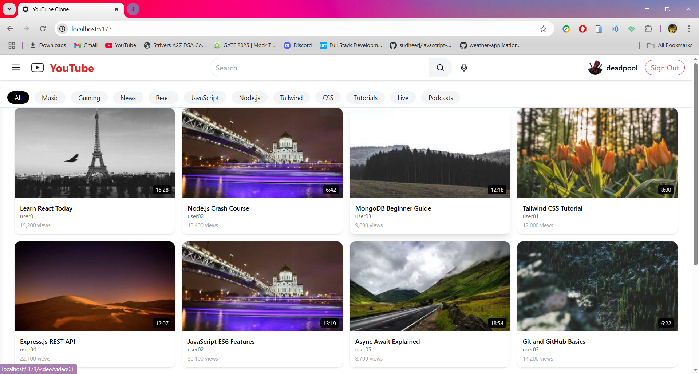
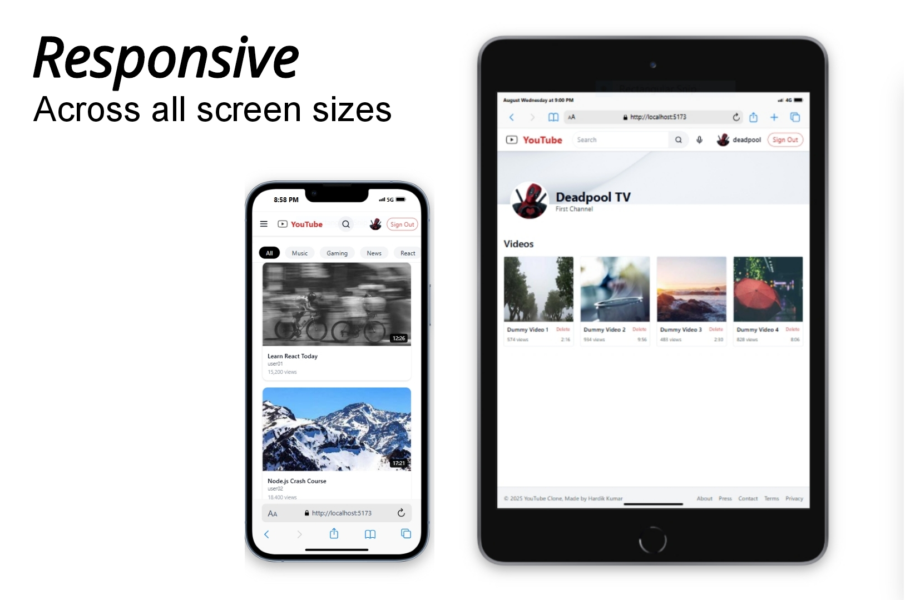

YouTube Clone - MERN Stack

A responsive YouTube-like video platform built with **React
(frontend)**, **Node.js + Express (backend)**, and **MongoDB
(database)**.\
It allows users to upload, watch, like/dislike videos, add/edit/delete
comments, and view suggested videos.

------------------------------------------------------------------------

## 🚀 Features


###  Video Player

-   Responsive video player with autoplay and full controls\
-   Shows **views, title, uploader, and description**\
-   Like / Dislike system with real-time update

###  Comments

-   Logged-in users can:
    -   Add comments\
    -   Edit their own comments\
    -   Delete their own comments\


### 📌 Suggested Videos

-   Sidebar with **"Up Next"** videos\
-   Excludes the currently playing video\
-   Clickable video cards with thumbnails, title, uploader, and views

###  User System

-   Local user authentication with **login persistence (localStorage)**\
-   Reactions (likes/dislikes) and comments are linked to logged-in
    users

###  Responsive Design

-   Works across desktop, tablet, and mobile\


------------------------------------------------------------------------

## Tech Stack

### Frontend

-   React + Vite\
-   React Router DOM\
-   Axios for API requests\
-   Tailwind CSS for styling\
-   Lucide Icons

### Backend

-   Node.js + Express\
-   MongoDB with Mongoose\
-   REST API endpoints for videos, likes, dislikes, comments

### In-App Preview



------------------------------------------------------------------------

## ⚙️ Installation & Setup

### 1️⃣ Clone the repository

``` bash
git clone https://github.com/hardikjha/yt-clone.git
cd youtube-clone
```

### 2️⃣ Backend Setup

``` bash
cd server
npm install
```

-   Create a `.env` file in `backend/`:

``` env
PORT=5000
MONGO_URI=your_mongodb_connection_string
```

-   Run the backend:

``` bash
npm run dev
```

------------------------------------------------------------------------

### 3️⃣ Frontend Setup

``` bash
cd client
npm install
```

-   Update API base URL in `src/api.js` (if different from
    `localhost:5000`).

-   Run the frontend:

``` bash
npm run dev
```

------------------------------------------------------------------------

### 4️⃣ Open in Browser

Visit  `http://localhost:5173`


------------------------------------------------------------------------

##  Usage 

1.  **Browse videos** on the homepage\
2.  **Click a video** → Opens VideoPage\
3.  **Like/Dislike** videos (login required)\
4.  **Comment** under videos (login required)\
5.  **Suggested videos** show up on the right side\
6.  **Responsive UI** → works smoothly on mobile and tab

------------------------------------------------------------------------

##  API Endpoints (Backend)

### Videos

-   `GET /api/videos` → Get all videos\
-   `GET /api/videos/:id` → Get single video by ID\
-   `POST /api/videos/:id/like` → Like a video\
-   `POST /api/videos/:id/dislike` → Dislike a video

### Comments

-   `POST /api/videos/:id/comments` → Add comment\
-   `PUT /api/videos/:id/comments/:commentId` → Edit comment\
-   `DELETE /api/videos/:id/comments/:commentId` → Delete comment

## Demo video has been added


[Repository link](https://github.com/hardikjha/yt-clone)